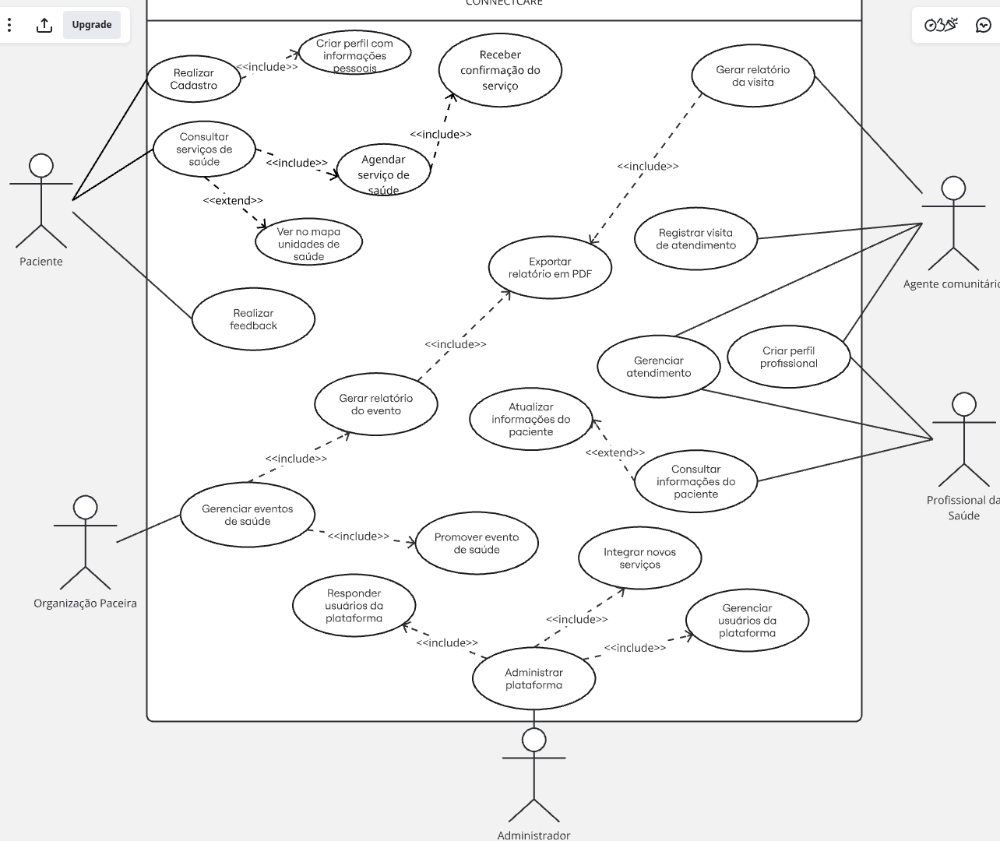

## Especificações de Casos de Uso

- [Consultar Serviços de Saúde](epecA.md)
- [Responder usuários da plataforma](specD.md)
- [Gerenciar eventos de saúde](specP.md)
- [Registrar Visita Domiciliar](specDi.md)
- [Criar perfil profissional](specR.md)

---

# Diagrama de Casos de Uso

## Introdução

No contexto do aplicativo **Connect Care**, a técnica de casos de uso foi utilizada como um facilitador no desenvolvimento do software. A modelagem de casos de uso é uma ferramenta fundamental na engenharia de software que permite identificar e documentar as funcionalidades do sistema sob a perspectiva dos usuários.

## Metodologia

Para o desenvolvimento dos casos de uso, seguimos os seguintes passos:

1. **Identificação dos atores**: Foram identificados os seguintes atores principais:
   - Paciente
   - Agente comunitário
   - Administrador 
   - Organizações parceira
   - Profissional de saúde

2. **Mapeamento dos Casos de Uso**: Realizado a partir de verificação com a equipe de desenvolvimento

3. **Desenvolvimento do diagrama**: Elaborado seguindo o padrão UML (Unified Modeling Language)

4. **Inclusão das relações**: Adicionadas relações de inclusão e extensão entre os casos de uso

5. **Revisão e análise**: Validação final do diagrama com a equipe

## Diagrama de Casos de Uso

O diagrama a seguir apresenta a modelagem dos casos de uso para o **Connect Care**:

 

## Considerações

O diagrama de casos de uso serve como uma ferramenta de comunicação entre stakeholders e desenvolvedores, fornecendo uma visão clara das funcionalidades do sistema e das interações entre os diferentes atores envolvidos.

