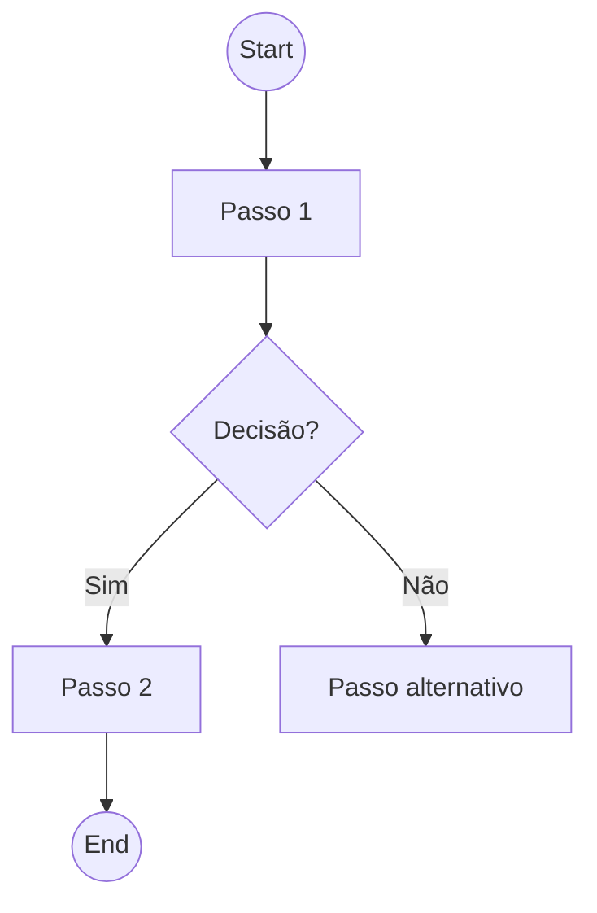

# {{FEATURE NAME}}

> **Modelo de documentação de feature** (copie e preencha os campos entre chaves)

---

## 1. Objetivo

Descreva em 1–2 frases o valor de negócio principal que esta feature entrega.

## 2. Contexto

* Link para requisito de alto nível / OKR
* Persona(s) impactadas
* Problemas que motivam esta feature

## 3. Fluxo Resumido (Mermaid opcional)

## 4. Modelo de Dados

| Campo     | Tipo   | Regra / Observação |
| --------- | ------ | ------------------ |
| `exemplo` | string | obrigatório        |

## 5. Regras de Negócio

1. RN-1: …
2. RN-2: …

## 6. KPIs / Métricas de Sucesso

* Tempo médio de execução:
* Aderência (% de uso):

## 7. Dependências

* API externas
* Bibliotecas / licenças
* Spikes necessários

## 8. Permissões

| Papel | Acesso          |
| ----- | --------------- |
| ADMIN | CRUD completo   |
| USER  | Somente leitura |

## 9. Escopo → Epics e PBIs

| Epic  | Código US / PBI | Descrição curta |
| ----- | --------------- | --------------- |
| EP-XX | US-XX           | …               |

## 10. Wireframes / Protótipos

* Figma:&#x20;
* Captura rápida:

## 11. Critérios de Aceitação Globais

* CA-1
* CA-2

## 12. Histórico de Revisões

| Data       | Versão | Autor    | Alteração           |
| ---------- | ------ | -------- | ------------------- |
| yyyy-mm-dd | 0.1    | Seu Nome | Criação do template |