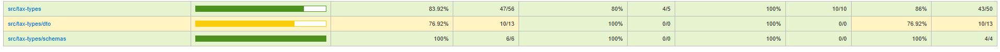
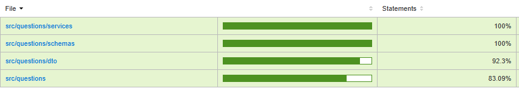
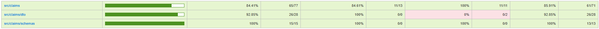

# Print dos testes unitários no backend

A corbetura foi avaliada utilizando o `coverage` da biblioteca Jest do NodeJs.

- **Testes das US-19, US-17, US-06**

- **Testes das US-11, US-09, US-08**

- **Testes das US-07, US-04, US-03**

- **US-20, US-14, US-15, US-12 não estão cobertas por testes**
