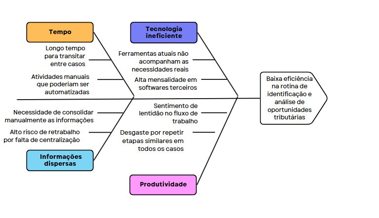

# Identificação da Oportunidade ou Problema

| Versão | Data       | Autor             | Alterações                                 |
| ------ | ---------- | ----------------- | ------------------------------------------ |
| 0.0    | -          | -                 | Versão inicial, documentação base herdada. |
| 1.1    | 01/05/2025 | Artur Krauspenhar | Especifica termos baixa e alta eficiência  |

---

Devido à necessidade de realizar diversas pesquisas manuais em diferentes sites/plataformas, análises sobre a saúde financeira das empresas-clientes e a elaboração de relatórios baseados nas teses tributárias aplicáveis a cada caso, o processo atual demanda um tempo significativo por parte do advogado. Essa dinâmica torna a transição de um caso para outro lenta e, em muitos casos, pode levar semanas para ser concluída, resultando numa baixa eficiência de seu trabalho.

A baixa eficiência na rotina de identificação e análise de oportunidades tributárias refere-se ao tempo elevado e ao esforço manual necessário para realizar essas tarefas, além da suscetibilidade a erros humanos. Em contraste, uma média eficiência seria caracterizada por um processo parcialmente automatizado, onde algumas etapas são otimizadas, mas ainda há dependência significativa de intervenções manuais. Já uma alta eficiência seria alcançada com a automação parcial das etapas principais, permitindo análises rápidas, precisas e com menor intervenção humana.

Para mensurar a eficiência, será analisado o tempo médio necessário para realizar a análise de uma empresa utilizando o software externo ClickFiscal em comparação com o nosso produto, o ConsultTributario. Esses dados serão coletados antes e após a implementação do ConsultTributario, permitindo demonstrar de forma clara e objetiva a evolução da eficiência ao longo do projeto.

Embora existam softwares terceirizados que automatizam parte desse trabalho, o cliente demonstra desmotivação em utilizá-los, principalmente em razão do elevado custo da mensalidade, que gira em torno de R$ 550,00. Além do fator financeiro, essas plataformas apresentam limitações importantes, como a baixa capacidade de personalização na análise de dados fiscais e na recomendação de teses jurídicas adequadas ao contexto específico do cliente. Como resultado, o advogado ainda precisa complementar essas análises manualmente, o que compromete a eficiência do processo.

## Diagrama de Ishikawa

O principal desafio do projeto é o cruzamento de informações com base em um CNPJ mapeando oportunidades tributárias de forma eficiente e confiável. Para isso, será necessário desenvolver mecanismos capazes de interpretar dados fiscais e contábeis, aplicando corretamente a legislação tributária vigente que está em constante mudança.

O diagrama representa os principais fatores que contribuem para o problema enfrentado pelo advogado tributarista: baixa eficiência na rotina de identificação e análise de oportunidades tributárias. Os principais pontos analisados foram: Tempo, Informações dispersas, produtividade e tecnologia ineficiente.

Diante desse cenário, o **ConsultTributario** se apresenta como uma alternativa viável e estratégica. A plataforma oferece uma solução com custo mais acessível, replicando a funcionalidade mais relevante do software atual: o questionário inteligente. Seu principal diferencial está na capacidade de preencher parcialmente esse questionário por meio de dados extraídos automaticamente do CNPJ da empresa, utilizando integrações com fontes públicas como a **BrasilAPI**.

Essa integração possibilita o acesso a informações detalhadas da pessoa jurídica, como porte, natureza jurídica, CNAE, situação cadastral, localização, entre outros dados fiscais relevantes. Com essas informações, o **ConsultTributario** antecipa parte das respostas do questionário de forma automatizada, otimizando o tempo do advogado e reduzindo significativamente o risco de erros.

Além disso, a plataforma gera relatórios personalizados com base no tipo de questionário aplicado, facilitando a análise jurídica de cada caso e fortalecendo a argumentação do advogado em suas teses. Essa combinação de automação inteligente, personalização e custo reduzido não apenas torna o **ConsultTributario** uma opção financeiramente atrativa, como também o posiciona como uma ferramenta mais eficiente e alinhada à rotina prática do profissional da área tributária.
