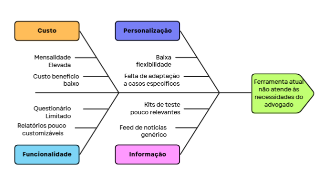

# Identificação da Oportunidade ou Problema

| Versão | Data | Autor | Alterações |
|--------|------|-------|------------|
| 0.0    | -    | -     | Versão inicial, documentação base herdada. |

---

Apesar de sua utilidade, o software que é utilizado pelo cliente apresenta algumas limitações. A falta de personalização no cruzamento das informações fiscais e na sugestão das teses mais adequadas faz com que o profissional ainda precise realizar análises manuais complementares. Isso evidencia uma oportunidade de evolução para soluções mais inteligentes e flexíveis, capazes de integrar dados automaticamente, adaptar-se às características específicas de cada empresa e fornecer recomendações mais precisas e personalizadas.

O ConsultTributario surge como uma alternativa viável, oferecendo uma solução com custo mais acessível, ao mesmo tempo em que replica as principais funcionalidades do software atual. O grande diferencial do ConsultTributario é sua capacidade de responder parcialmente o questionário com base no CNPJ da empresa. Toda empresa no Brasil possui um CNPJ e, com ele, é possível acessar diversas informações sobre ela, como porte, natureza jurídica, CNAE, situação cadastral, localização, entre outros dados públicos e relevantes para análises fiscais. Utilizando essas informações de forma automatizada, o ConsultTributario consegue antecipar parte das respostas do questionário, otimizando o tempo do advogado e reduzindo o risco de erros.

Essa maior otimização no seu uso, aliada ao custo reduzido, não apenas torna o ConsultTributario uma opção mais atrativa financeiramente, mas também proporciona ao advogado uma solução mais eficiente e alinhada com a sua prática cotidiana.

## Diagrama de Ishikawa

O diagrama representa os principais fatores que contribuem para o problema enfrentado pelo advogado tributarista: a ferramenta atual não atende às suas necessidades específicas. Os principais pontos analisados foram: custo, funcionalidade, personalização e informação.

