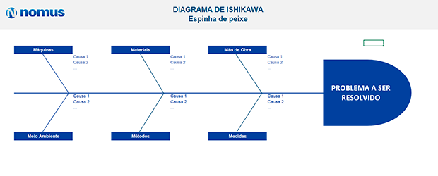

# Identificação da Oportunidade ou Problema

| Versão | Data | Autor | Alterações |
|--------|------|-------|------------|
| 0.0    | -    | -     | Versão inicial, documentação base herdada. |

---

Atualmente, o cliente, um advogado tributarista, utiliza um software especializado para facilitar a identificação e gestão de oportunidades de recuperação tributária, prática comum no contexto tributário empresarial. O sistema oferece funcionalidades como um questionário que analisa as informações fiscais e gera relatórios com teses tributárias aplicáveis.

Contudo, o software apresenta limitações significativas:

- Mensalidades elevadas;
- Flexibilidade restrita para personalização da plataforma às necessidades específicas do cliente;
- Funcionalidades valiosas como feed de notícias diárias e kits de testes não são plenamente adaptáveis, reduzindo a eficiência em casos específicos.

O **ConsultTributario** surge como alternativa viável e mais acessível, mantendo as principais funcionalidades do software atual, porém com um diferencial significativo: alta capacidade de personalização. A plataforma pode ser facilmente ajustada às necessidades específicas de cada cliente, sem complexidade excessiva ou altos custos.

Essa personalização, aliada ao custo reduzido, proporciona uma solução mais eficiente, alinhada com a prática cotidiana do advogado tributarista.

## Diagrama de Ishikawa

O diagrama a seguir representa os principais fatores que contribuem para o problema enfrentado pelo advogado tributarista: a ferramenta atual não atende plenamente às necessidades específicas.

Os principais fatores analisados foram:

- Custo
- Funcionalidade
- Personalização
- Informação
