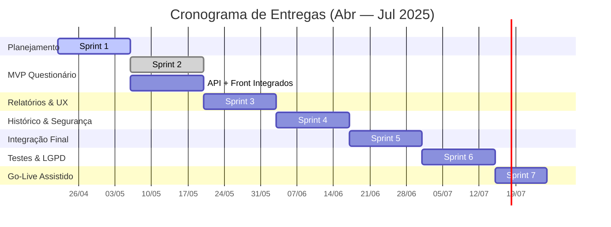

# Cronograma de Entregas

| Versão | Data       | Descrição                                  | Autor           |
| ------ | ---------- | ------------------------------------------ | --------------- |
| 1.0    | 21/04/2025 | Versão inicial                             | Vinicius Vieira |
| 1.1    | 06/05/2025 | Refinamento de sprints e inclusão de Gantt | Vinicius Vieira |

---

## Visão Geral em Gantt

## Detalhamento das Sprints

| Sprint | Período       | Objetivo Principal                                                            | Entregas Chave                                                            | Validação do Cliente                         |
| ------ | ------------- | ----------------------------------------------------------------------------- | ------------------------------------------------------------------------- | -------------------------------------------- |
| **1**  | 22/04 → 05/05 | Planejamento & Setup (backlog DEEP, arquitetura inicial, critérios DoR / DoD) | Backlog priorizado, repositórios configurados, pipeline CI/CD básico      | Reunião de alinhamento, aprovação do backlog |
| **2**  | 06/05 → 19/05 | MVP do Questionário (API + Front integrados)                                  | Endpoint `/questions`, seed com 15 teses, fluxo ponta‑a‑ponta funcionando | Demonstração funcional ao cliente            |
| **3**  | 20/05 → 02/06 | Relatórios preliminares & UX inicial                                          | Geração de PDF preliminar, testes de usabilidade com 3 usuários‑alvo      | Feedback sobre formato dos relatórios        |
| **4**  | 03/06 → 16/06 | Histórico de respostas & Segurança base                                       | Histórico v1, RBAC mínimo, criptografia at‑rest                           | Checagem de segurança e rastreabilidade      |
| **5**  | 17/06 → 30/06 | Integração Completa & UX Final                                                | Pact tests, design system aplicado em todas as telas                      | Teste de aceite de interface                 |
| **6**  | 01/07 → 14/07 | Testes & Conformidade LGPD                                                    | Cobertura ≥ 80 %, DPIA LGPD, plano de mitigação                           | Aprovação de conformidade preliminar         |
| **7**  | 15/07 → 24/07 | Go‑Live Assistido                                                             | Treinamento, monitoramento inicial, aceite formal                         | Assinatura de aceite                         |

??? note "Riscos Conhecidos"
\* Mudanças na legislação tributária
\* Instabilidade em APIs públicas de referência
\* Complexidade adicional em requisitos LGPD

??? tip "Reuniões de Validação"
As validações com o cliente ocorrerão **quinzenalmente**, sempre na 6ª‑feira da segunda semana da sprint.

---
