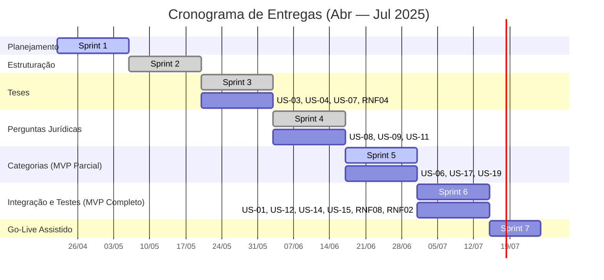

# Cronograma de Entregas

| Versão | Data       | Descrição                                  | Autor           |
| ------ | ---------- | ------------------------------------------ | --------------- |
| 1.0    | 21/04/2025 | Versão inicial                             | Vinicius Vieira |
| 1.1    | 06/05/2025 | Refinamento de sprints e inclusão de Gantt | Vinicius Vieira |
| 1.2    | 26/05/2025 | Atualizações de datas e mudanças nas sprints | Daniel Ferreira Nunes |
| 1.3    | 23/06/2025 | Adição das US | Daniel Ferreira Nunes |

---

## Visão Geral em Gantt

## Detalhamento das Sprints

| Sprint | Período       | Objetivo Principal                                                            | Entregas Chave                                                            | Validação do Cliente                         |
| ------ | ------------- | ----------------------------------------------------------------------------- | ------------------------------------------------------------------------- | -------------------------------------------- |
### Cronograma de Entregas Atualizado

| Sprint | Período       | Objetivo Principal                  | Entregas Chave                                                                                                                 | Validação do Cliente                                             |
| :----- | :------------ | :---------------------------------- | :----------------------------------------------------------------------------------------------------------------------------- | :--------------------------------------------------------------- |
| **1** | 22/04 → 05/05 | Planejamento & Setup                | Backlog priorizado (DEEP), arquitetura inicial definida, protótipo de tarefas, repositórios e pipeline CI/CD configurados.          | Reunião de alinhamento, aprovação do backlog.                    |
| **2** | 06/05 → 19/05 | Estruturação e Prototipação         | Estrutura básica do projeto (Frontend/Backend), protótipo de alta fidelidade no Figma para guiar o desenvolvimento.                 | Demonstração do protótipo e da estrutura.                        |
| **3** | 20/05 → 02/06 | Autenticação e Gestão de Teses      | **1.** Implementação de Login/Registro (RNF04).   **2.** CRUD de Teses: US-03, US-04, US-07.   **3.** Visualização de Teses: US-07.                                        | Validação do fluxo de autenticação e gerenciamento de teses.     |
| **4** | 03/06 → 16/06 | Gestão de Perguntas Jurídicas       | **1.** CRUD de Perguntas: US-08, US-09, US-11.                                                                               | Revisão e validação das funcionalidades de gerenciamento de perguntas. |
| **5** | 17/06 → 30/06 | Gestão de Categorias **(MVP Parcial)** | **1.** Gestão de Categorias: US-06, US-19, US-17.    | Demonstração das funcionalidades de categorias e validação dos refinamentos. |
| **6** | 01/07 → 14/07 | Integração e Testes **(MVP Completo)**        | **1.** Busca por CNPJ (US-01, RNF08).   **2.** Geração de relatório (US-14, RNF02).   **3.** Questionário de diagnóstico (US-12).   **4.** Funcionalidades complementares: US-15.   | **Validação do MVP completo** e plano de testes. |
| **7** | 15/07 → 24/07 | Go-Live Assistido e Deploy Final    | **1.** Entrega final da aplicação.   **2.** Treinamento ao cliente e monitoramento inicial do ambiente de produção.             | Assinatura do termo de aceite e homologação do software.         |

---
