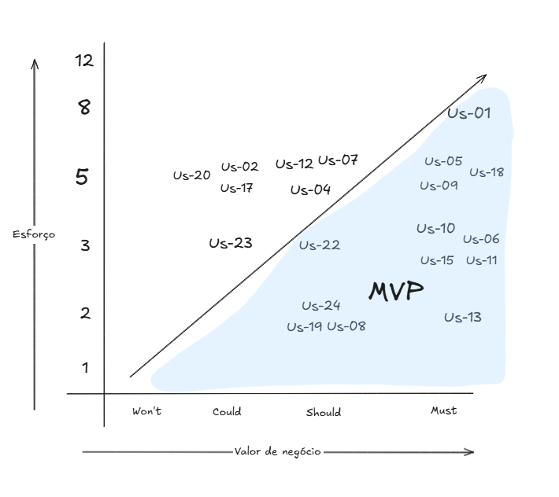

## Histórico de Versão:

| Data     | Versão | Descrição                       | Autor             |
| -------- | ------ | ------------------------------- | ----------------- |
| 20/05/25 | 1.0    | Criação do Documento            | Artur Krauspenhar |
| 24/05/25 | 1.1    | Prioriza backlog                | Artur Krauspenhar |
| 26/05/25 | 1.2    | Revisão e correção              | Rafael Schadt     |
| 08/06/25 | 2.0    | Refatoração completa do backlog | Artur Krauspenhar |

O backlog de produto é uma lista dinâmica e priorizada que contém todos os requisitos, funcionalidades, melhorias e correções que serão necessárias para o desenvolvimento de um produto. Ele funciona como um guia para a equipe de desenvolvimento, servindo de referência para todas as tarefas que precisam ser realizadas ao longo do ciclo de vida do projeto. Essa lista não é fixa, mas sim atualizável conforme o produto evolui e novas necessidades surgem, garantindo que o time esteja sempre alinhado às prioridades e expectativas do projeto.

## 1 - Requisitos Funcionais

| Código | Descrição                                                   |
| ------ | ----------------------------------------------------------- |
| RF01   | Consultar dados públicos de uma empresa a partir do CNPJ    |
| RF02   | Editar dados retornados do CNPJ                             |
| RF03   | Criar tese tributária                                       |
| RF04   | Editar tese tributária                                      |
| RF05   | Apagar tese tributária                                      |
| RF06   | Criar categorias de teses tributárias                       |
| RF07   | Visualizar teses tributárias cadastradas                    |
| RF08   | Criar pergunta jurídica                                     |
| RF09   | Editar pergunta jurídica                                    |
| RF10   | Apagar pergunta jurídica                                    |
| RF11   | Visualizar perguntas jurídicas cadastradas                  |
| RF12   | Realizar questionário de diagnóstico tributário             |
| RF13   | Editar respostas preenchidas no questionário de diagnóstico |
| RF14   | Visualizar relatório de teses tributária aplicáveis         |
| RF15   | Apagar questionário de diagnóstico já preenchido            |
| RF16   | Exportar relatório de teses aplicáveis em PDF               |
| RF17   | Editar categoria de teses tributária                        |
| RF18   | Apagar categoria de teses tributária                        |
| RF19   | Visualizar categorias de teses tributária cadastradas       |

## 2 - Requisitos Não Funcionais

| Código | Descrição                                                                                                       |
| ------ | --------------------------------------------------------------------------------------------------------------- |
| RNF01  | O sistema deve responder a ações do usuário (como cliques em botões, navegação entre telas ou envio de formulários) em até 2 segundos, em rede estável (ping ≤ 200ms, banda ≥ 10 Mbps), medido no navegador do cliente. |
| RNF02  | A geração de relatórios em PDF, como os de teses aplicáveis, deve ser concluída em no máximo 5 segundos.                                      |
| RNF03  | O sistema deve obrigatoriamente usar HTTPS em todas as comunicações.                                            |
| RNF04  | As credenciais dos usuários devem ser protegidas com hash utilizando a biblioteca bcrypt do Node.js.            |
| RNF05  | O sistema deve registrar logs contendo: ID do usuário (ou anônimo), IP de origem, endpoint acessado, data/hora, tipo de ação (login, edição, falha, erro), e o código de resposta da requisição.  |
| RNF07  | Logs devem ser armazenados no banco de dados (MongoDB) com retenção mínima de 6 meses para fins de auditoria e diagnóstico.                                           |
| RNF08  | Toda comunicação com APIs externas ( BrasilAPI, ReceitaWS ou InfoSimples) deve ocorrer via HTTPS para garantir a integridade e confidencialidade dos dados.                                                      |
| RNF09  | Toda a interface textual do sistema (rótulos, mensagens de erro, botões e descrições) deve ser escrita em português correto e estar livre de erros gramaticais e ortográficos, além de evitar termos técnicos de TI como “API”, “payload”, “token” e similares.       |

## Histórias de Usuário

- **US-01**: Consultar dados públicos de uma empresa a partir do CNPJ

  _Como usuário, quero visualizar os dados públicos de uma empresa após inserir seu número de CNPJ, para entender melhor o perfil e a situação cadastral da empresa consultada._

- **US-02**: Editar dados retornados do CNPJ

  _Como usuário, quero revisar e corrigir manualmente os dados do CNPJ consultado, para garantir que estejam corretos antes de usá-los em um levantamento de teses aplicáveis._

- **US-03**: Criar tese tributária

  _Como advogado, quero cadastrar novas teses tributárias no sistema, para ampliar a base de conhecimento jurídico da plataforma._

- **US-04**: Editar tese tributária

  _Como advogado, quero editar as teses tributárias já cadastradas, para manter as informações sempre atualizadas e corretas._

- **US-05**: Excluir tese tributária

  _Como advogado, quero excluir uma tese tributária do sistema, para remover conteúdos desatualizados ou incorretos._

- **US-06**: Criar categorias de teses tributárias

  _Como advogado, quero criar novas categorias para agrupar teses tributárias, para manter a base de dados organizada._

- **US-07**: Visualizar teses tributárias cadastradas

  _Como usuário, quero visualizar a lista de teses tributárias cadastradas e poder pesquisar por nome, palavra-chave, ou agrupá-las por categorias para visualizar as teses cadastradas no sistema._

- **US-08**: Criar pergunta jurídica

  _Como advogado, quero cadastrar novas perguntas jurídicas com as únicas alternativas “sim”, “não sei” e “não”, para usá-las nos questionários e relacioná-las a teses._

- **US-09**: Editar pergunta jurídica

  _Como advogado, quero editar perguntas jurídicas já cadastradas, para ajustar seu conteúdo conforme necessário._

- **US-10**: Excluir pergunta jurídica

  _Como advogado, quero excluir perguntas jurídicas do sistema, para remover aquelas que não são mais úteis ou estão desatualizadas._

- **US-11**: Visualizar perguntas jurídicas cadastradas

  _Como advogado, quero visualizar todas as perguntas jurídicas cadastradas, para ver as perguntas que irão aparecer no questionário de diagnóstico._

- **US-12**: Realizar questionário de diagnóstico tributário

  _Como usuário, quero iniciar um questionário de diagnóstico com as perguntas cadastradas, para fazer um diagnóstico de teses tributárias aplicáveis a uma determinada empresa._

- **US-13**: Editar respostas preenchidas no questionário de diagnóstico

  _Como usuário, quero editar as respostas que marquei em um questionário já respondido, para corrigir informações e garantir que o diagnóstico gerado reflita com precisão a situação atual da empresa._

- **US-14**: Visualizar relatório de teses tributárias aplicáveis

  _Como usuário, quero visualizar um relatório com as teses tributárias aplicáveis com base em um questionário de diagnóstico respondido, para apoiar a tomada de decisões jurídicas com base nas respostas fornecidas._

- **US-15**: Apagar questionário de diagnóstico já preenchido

  _Como usuário, quero apagar um questionário de diagnóstico que já preenchido e foi salvo, para manter meu sistema organizado sem questionários que não serão mais consultados._

- **US-16**: Exportar relatório de teses aplicáveis em PDF

  _Como usuário, quero exportar o relatório de teses aplicáveis em formato PDF, para compartilhamento ou impressão._

- **US-17**: Editar categoria de teses tributária

  _Como advogado, quero editar o nome de uma categoria de tese tributária, para manter a organização da base de dados e corrigir erros ou padronizar nomenclaturas._

- **US-18**: Apagar categoria de teses tributária

  _Como advogado, quero poder apagar uma categoria de tese tributária, para remover agrupamentos que não fazem mais sentido ou foram criados incorretamente._

- **US-19**: Visualizar categorias de teses tributária cadastradas

  _Como advogado, quero visualizar uma lista com todas as categorias de teses tributárias cadastradas no sistema, para entender como as teses estão organizadas e facilitar a navegação e o filtro por temas._

## Épicos

| Código | Título do Épico                         |
| ------ | --------------------------------------- |
| EP-01  | Gerenciamento de Teses Jurídicas        |
| EP-02  | Gerenciamento de Perguntas              |
| EP-03  | Gerenciamento de CNPJ                   |
| EP-04  | Gerenciamento de Diagnóstico Tributário |

| Código US | Código RF | Épico Relacionado |
| --------- | --------- | ----------------- |
| US-01     | RF01      | EP-03             |
| US-02     | RF03      | EP-03             |
| US-03     | RF04      | EP-01             |
| US-04     | RF05      | EP-01             |
| US-05     | RF06      | EP-01             |
| US-06     | RF07      | EP-01             |
| US-07     | RF09      | EP-01             |
| US-17     | RF18      | EP-01             |
| US-18     | RF19      | EP-01             |
| US-19     | RF20      | EP-01             |
| US-08     | RF10      | EP-02             |
| US-09     | RF08      | EP-02             |
| US-10     | RF03      | EP-02             |
| US-11     | RF12      | EP-02             |
| US-12     | RF13      | EP-04             |
| US-13     | RF14      | EP-04             |
| US-14     | RF15      | EP-04             |
| US-15     | RF16      | EP-04             |
| US-16     | RF17      | EP-04             |

## Priorização do Backlog

A priorização apresentada foi revisada com base na complexidade estimada e no valor de negócio de cada história de usuário. Para estimar a complexidade, utilizamos Story Points seguindo a sequência de Fibonacci (1, 2, 3, 5, 8, 13...), levando em consideração fatores como esforço técnico, grau de incerteza e impacto funcional.

O valor de negócio foi avaliado em conjunto com o cliente por meio da técnica de priorização MoSCoW (Must have, Should have, Could have, Won’t have), permitindo identificar os requisitos de maior relevância para o negócio.

- **Must have**  
  Funcionalidades essenciais, indispensáveis para o funcionamento mínimo do produto. Sua entrega é obrigatória, pois sem elas o produto não atende aos requisitos básicos de uso ou de negócio.

- **Should have**  
  Funcionalidades importantes, que agregam valor significativo ao produto, mas que podem ser implementadas após os itens críticos. Embora não sejam vitais para o funcionamento imediato, sua ausência pode impactar a experiência do usuário ou a eficiência do sistema.

- **Could have**  
  Funcionalidades desejáveis, que aumentam a atratividade ou conveniência do produto, mas que não são essenciais no escopo inicial. Podem ser consideradas caso haja tempo ou recursos disponíveis.

- **Won't have**  
  Funcionalidades, requisitos ou melhorias que não serão implementados nesta versão do produto. São itens identificados como desejáveis ou interessantes, mas que, após análise com o cliente e a equipe, foram considerados fora do escopo atual devido a restrições de tempo, orçamento, tecnologia ou alinhamento estratégico.

A definição do MVP (Produto Mínimo Viável) foi realizada a partir da combinação entre alto valor de negócio e complexidade viável. Dessa forma, requisitos com alta complexidade e menor valor agregado foram excluídos do escopo do MVP, priorizando entregas com maior retorno e menor esforço de implementação.

| Código US | Descrição                                                   | Prioridade | Story Points | MVP |
| --------- | ----------------------------------------------------------- | ---------- | ------------ | --- |
| US-01     | Consultar dados públicos de uma empresa a partir do CNPJ    | Must       | 8            | X   |
| US-03     | Criar tese tributária                                       | Must       | 8            | X   |
| US-07     | Visualizar teses tributárias cadastradas                    | Must       | 5            | X   |
| US-14     | Visualizar relatório de teses tributária aplicáveis         | Must       | 5            | X   |
| US-04     | Editar tese tributária                                      | Must       | 3            | X   |
| US-08     | Criar pergunta jurídica                                     | Must       | 5            | X   |
| US-09     | Editar pergunta jurídica                                    | Must       | 3            | X   |
| US-12     | Realizar questionário de diagnóstico tributário             | Must       | 5            | X   |
| US-11     | Visualizar perguntas jurídicas cadastradas                  | Must       | 2            | X   |
| US-15     | Apagar questionário de diagnóstico já preenchido            | Should     | 2            | X   |
| US-06     | Criar categorias de teses tributárias                       | Should     | 2            | X   |
| US-19     | Visualizar categorias de teses tributária cadastradas       | Should     | 2            | X   |
| US-17     | Editar categoria de teses tributária                        | Should     | 3            | X   |
| US-05     | Excluir tese tributária                                     | Should     | 5            |     |
| US-10     | Excluir pergunta jurídica                                   | Should     | 5            |     |
| US-02     | Editar dados retornados do CNPJ                             | Could      | 5            |     |
| US-13     | Editar respostas preenchidas no questionário de diagnóstico | Could      | 5            |     |
| US-16     | Exportar relatório de teses aplicáveis em PDF               | Could      | 5            |     |
| US-18     | Apagar categoria de teses tributária                        | Could      | 3            |     |
